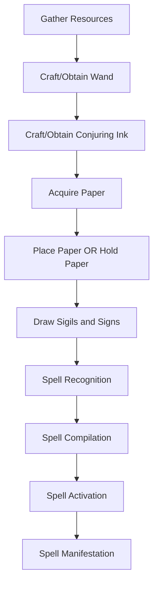
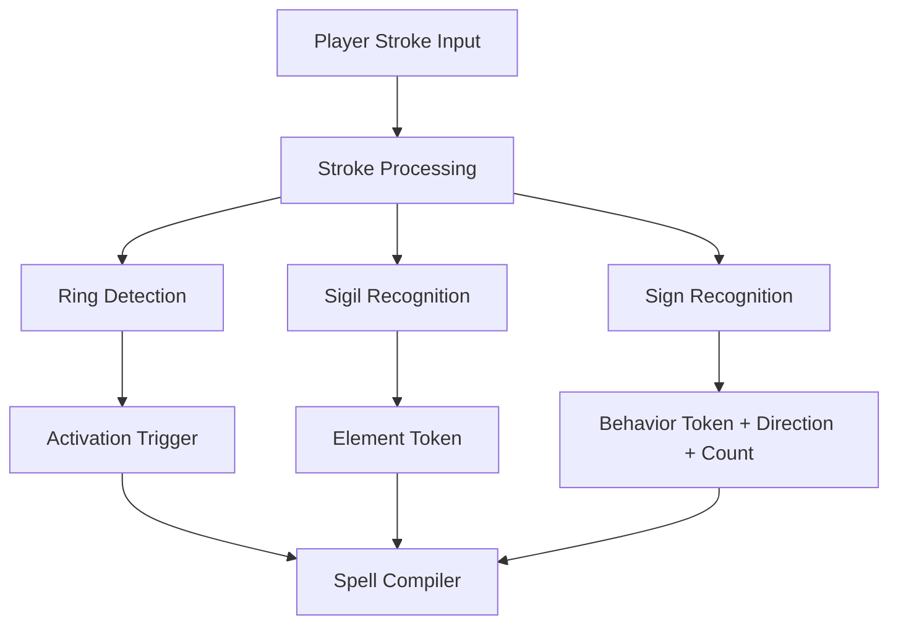
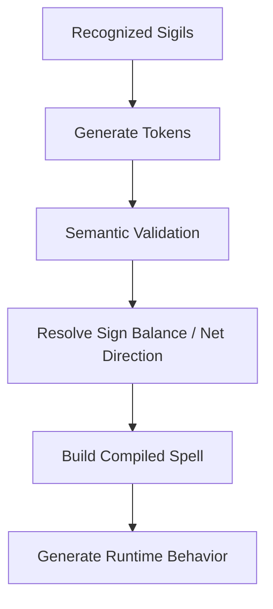
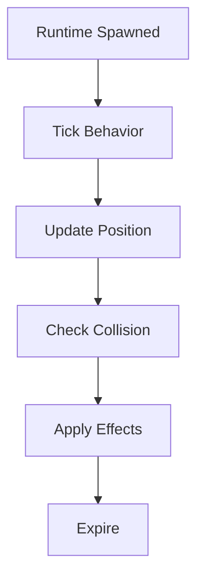
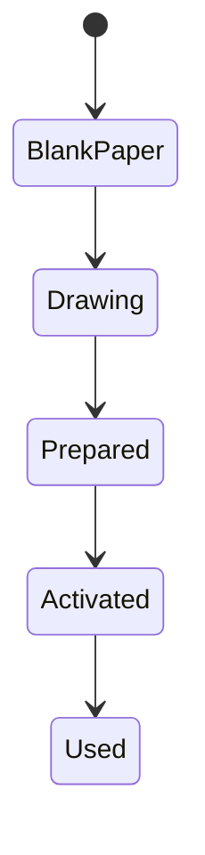

# Witch Hat Atelier Inspired Magic System — Architecture Plan

# Core Design Philosophy

The player does NOT possess innate magic.

Magic exists externally through:

- Conjuring Ink
- Magical Tools (Wands)
- Drawn Geometry
- Magical Mediums (Paper)
- Environmental Positioning

The player acts as a "compiler" or "scribe" of magical phenomena.

---

# Core Gameplay Loop



---

# Core Concepts

---

# Glyph Structure

Every spell is called a **glyph**. A glyph is composed of exactly three components:

```
Glyph = Ring + Sigil (center) + Signs (arranged around sigil)
```

A glyph only activates when the **ring is fully closed**. The ring is the trigger — not the drawing of the signs.

---

## Ring — Activation Rules

The ring is a circle that encloses the sigil and signs. Closing the ring is what activates the spell.

| Ring State | Behavior |
|---|---|
| Open (gap exists) | Spell is **prepared** — sigil and signs are inscribed but inert |
| Closed | Spell **activates immediately** |
| Two nested rings, gap between them filled | Both spells **combine and activate together** |

A player can draw the full sigil and signs, then leave a deliberate gap in the ring. The spell is prepared but dormant. Closing the gap later activates it instantly on demand.

**Gap detection rule:** Track arc coverage of the drawn ring stroke. If arc coverage ≥ ~358°, the ring is considered closed.

---

## Spell Quality

The quality of a spell depends on two properties of its inscription:

| Property | Effect |
|---|---|
| **Size** | Larger seals are **stronger** |
| **Neatness** | Neatly drawn seals **last longer** than messy ones |

Quality does NOT decide whether a spell activates. A poor-quality spell still works — it just performs worse.

| Quality Range | Gameplay Result |
|---|---|
| 0.0 – 0.3 | Unstable / near failure |
| 0.3 – 0.5 | Weak |
| 0.5 – 0.8 | Normal |
| 0.8 – 1.0 | Excellent |

---

## Sigils

A sigil is placed at the **center** of the glyph. It defines the **element** of the spell — what substance or energy manifests.

There are five main sigils:

| Sigil | Element | Nature |
|---|---|---|
| Fire | Heat, combustion | Destructive, spreading |
| Water | Liquid, flow | Kinetic, extinguishing |
| Earth | Matter, stone | Solid, persistent |
| Air | Wind, motion | Invisible, force-based |
| Light | Illumination, energy | Instant, penetrating |

Certain signs — such as **Vision**, **Repetition**, and **Billowing** — can serve as the sigil within their respective spells. These fall outside the five main sigils and are treated as a special category. The compiler detects this when no main sigil is present and a qualifying sign occupies the center position.

---

## Signs

Signs are placed **between the sigil and the ring**, arranged around the central sigil. They determine the **form** in which the element manifests.

### Sign Placement and Symmetry

| Arrangement | Effect |
|---|---|
| Radial symmetry (evenly spaced) | Stable, full-power spell |
| Bilateral symmetry (mirrored halves) | Stable, directional spell |
| Asymmetric | Valid spell, but **instability penalty** applied |

### Directional Balance Score

For directional signs (Column, Levitation, Bolt), the compiler computes a **net direction** from sign placement:

```
For each sign placed at angle θ:
    weight += sign_vector(θ) × sign_count_at_θ

NetDirection = normalize(sum of all weight vectors)
```

- If signs are **perfectly balanced**, NetDirection is a zero vector → spell fires along the paper normal (straight up for floor placement).
- If signs are **unbalanced**, NetDirection points toward the heavier side → spell fires that way.

---

# Sign Reference

---

## Column

> Causes the magic of its glyph to manifest in a **column or beam above the glyph**. If signs are unbalanced, the spell manifests in the direction with the most signs. The shorter line on the sign typically faces outward.

### Direction Rules

| Condition | Result |
|---|---|
| Signs balanced (radial) | Column fires along paper normal (perpendicular to paper surface) |
| Signs unbalanced | Column fires toward the side with more signs |
| Single column sign | Column fires in the direction the sign's short end faces |

### With Each Sigil

| Sigil + Column | Effect |
|---|---|
| Fire + Column | Flame pillar rising from glyph surface |
| Water + Column | High-pressure water jet — narrow and fast |
| Earth + Column | Stone pillar erupts upward, forms a persistent structure |
| Air + Column | Wind beam — invisible but applies knockback along its length |
| Light + Column | Light beam — penetrates until energy depletes |

### Scaling

| Property | Column Behavior |
|---|---|
| Size | Controls column height and width |
| Quality | Controls duration and stability; low quality causes flickering and early collapse |

---

## Dispersion

> Causes the magic of its glyph to **pour or disperse outward** in all directions. Behaves like Column but leaks magic instead of shooting it — lower velocity, wider spread, no focused direction.

### Direction Rules

| Condition | Result |
|---|---|
| Balanced signs | Even radial spread in all directions |
| Unbalanced signs | Spread biased toward heavier side, thinner on opposite |
| Paper placed on floor | Spreads along the floor plane outward |
| Paper placed on wall | Spreads outward from the wall face |

### With Each Sigil

| Sigil + Dispersion | Effect |
|---|---|
| Fire + Dispersion | Fire spreads outward from glyph like spilled embers |
| Water + Dispersion | Water pours out radially — like an overflowing bucket |
| Earth + Dispersion | Rocks and debris eject outward in all directions |
| Air + Dispersion | Wind burst — radial knockback from glyph origin |
| Light + Dispersion | Flash — brief radial light pulse, blinds nearby entities |

### Column vs Dispersion

| | Column | Dispersion |
|---|---|---|
| Speed | Fast | Slow |
| Range | Long | Short |
| Direction | Single focused direction | Omnidirectional |
| Shape | Narrow beam | Wide spread |

---

## Levitation

> Causes the spell's magic to **float above the glyph**, or causes the **movement of the object it is drawn on**. If the latter, movement direction depends on which direction the signs point.

### Two Modes

The compiler determines the mode based on what the glyph is drawn on:

**Mode A — Floating Effect** (paper placed on a surface):
The spell's element floats as a suspended entity above the glyph.

| Sigil + Levitation | Effect |
|---|---|
| Fire + Levitation | A floating flame hovers above the glyph |
| Light + Levitation | A floating light source — acts as a magical lantern |
| Water + Levitation | A floating water sphere that slowly drips |
| Earth + Levitation | A block or stone levitates above the glyph |
| Air + Levitation | An upward air current — entities above are pushed upward |

**Mode B — Object Movement** (glyph drawn on a moveable object):
The object itself is propelled in the direction the signs point.

| Sign Direction | Object Movement |
|---|---|
| Signs pointing up | Object rises |
| Signs pointing in a lateral direction | Object moves that direction |
| Signs pointing inward (radial) | Object stays suspended — balanced force |
| Signs unbalanced | Object drifts toward the heavy side |

### Scaling

| Property | Levitation Behavior |
|---|---|
| Size | Controls lift force and float height |
| Quality | Controls stability; low quality causes wobbling and unintended drift |

---

## Convergence

> Causes the magic of its spell to become **more focused**, centered down to a single point. Can also make loose particles become more rigid.

### Behavior Rules

| Condition | Result |
|---|---|
| Applied to an element | Element is pulled and compressed toward the glyph's center point |
| Used as modifier on another spell (nested ring) | Tightens the spell's area of effect, increases density |
| Paired with Dispersion (nested rings) | Creates a contained field — matter spreads out then is pulled back inward |

### With Each Sigil

| Sigil + Convergence | Effect |
|---|---|
| Fire + Convergence | Flame compresses to a point — superheated focal burn |
| Water + Convergence | Water pulls inward — suction vortex |
| Earth + Convergence | Debris and loose matter pulled toward the glyph point |
| Air + Convergence | Vacuum — pulls air and nearby entities inward |
| Light + Convergence | Light focuses to a laser-thin beam — ignites on contact |

### Loose Particle Rigidity Rule

If the spell's element is already in a dispersed or particle state (smoke, scattered embers, loose debris), Convergence compresses them into a denser, more rigid form. This enables multi-stage spell combos where a spell first scatters matter, then a Convergence spell collapses it.

---

## Bolt

> Causes the magic of its spell's sigil to manifest in the form of **bolts**. When paired with a directional sign, bolts can be shot at dangerous speed.

### Direction Rules

| Condition | Result |
|---|---|
| Single bolt sign | One bolt fires in the sign's facing direction |
| Multiple bolt signs, different angles | Bolts fan out (spread shot) |
| Multiple bolt signs, same direction | Burst volley in one direction |
| No clear direction (radial) | Bolts fire outward in all radial directions |

### With Each Sigil

| Sigil + Bolt | Effect |
|---|---|
| Fire + Bolt | Fireball — ignites on impact |
| Water + Bolt | Water bolt — high-speed narrow jet, knocks back on impact |
| Earth + Bolt | Stone shard — physical impact, embeds in terrain |
| Air + Bolt | Wind dart — invisible, fast, strong knockback |
| Light + Bolt | Light beam — instant travel (hitscan), no projectile drop |

### Bolt vs Column

| | Bolt | Column |
|---|---|---|
| Anchor | Detached — travels freely | Anchored to the glyph |
| Behavior | Projectile — impacts and resolves | Sustained beam or pillar |
| Range | Limited by speed and duration | Limited by energy |

### Scaling

| Property | Bolt Behavior |
|---|---|
| Size | Controls bolt size and impact area |
| Quality | Controls accuracy, travel speed, and range falloff |
| Low quality | Bolt wobbles, loses speed quickly, may detonate early |

---

# Nested Ring Rule — Spell Combination

Two glyphs can be combined by nesting their rings:

```
[ Outer Ring — Spell A ]
    [ Gap between rings — filled to activate ]
        [ Inner Ring — Spell B ]
```

The compiler treats them as a **combined spell**:
- Spell B's output feeds into Spell A's behavior
- The combined spell activates when the gap between the two rings is closed

**Example combinations:**

| Inner Spell | Outer Spell | Combined Effect |
|---|---|---|
| Fire + Column | Air + Dispersion | Fire pillar that also releases a wind burst at its peak |
| Water + Bolt | Earth + Convergence | Water bolts that pull loose debris inward on impact |
| Light + Levitation | Fire + Dispersion | Floating light that radiates fire outward |

**Cross-paper rule:** The nested ring does not require the same physical paper. If two papers are positioned so their rings are adjacent and touching, the spell bridge is valid across them.

---

# Spell Recognition Architecture



---

# Symbol Structure

```java
class Sign {

    SignType type;

    float direction;

    float size;

    float quality;

    float symmetry;

    float confidence;
}
```

---

# Sign Balance Analysis

```java
class SignBalance {

    Vec2f netDirection;   // zero vector = balanced, nonzero = directional bias

    float symmetryScore;  // 1.0 = perfect radial, 0.0 = fully asymmetric

    boolean isStable;     // false if symmetryScore below instability threshold
}
```

---

# Quality Evaluation System

Quality is measured separately from recognition. Recognition answers **"what symbol is this?"** Quality answers **"how well was it drawn?"**

## Quality Metrics

| Metric | Measures |
|---|---|
| Shape Accuracy | How closely the symbol matches its intended template |
| Smoothness | Shakiness and stroke consistency |
| Symmetry | Balance of the drawing (critical for circles, convergence signs) |
| Closure | Whether closed shapes are fully closed |
| Proportional Consistency | Whether important shape ratios are preserved |

## Quality Output

```java
class SymbolQuality {

    float accuracy;

    float smoothness;

    float symmetry;

    float closure;

    float overall;
}
```

## Quality Effects on Spells

| Property | Effect of Quality |
|---|---|
| Duration | Higher quality lasts longer |
| Stability | Less distortion and drift |
| Efficiency | Lower ink consumption |
| Strength | Better output |
| Failure Chance | Reduced instability at high quality |

---

# Spell Compiler System

The compiler transforms recognized symbols into executable magical instructions.

## Compiler Inputs

```
Sigils
+ Signs
+ Sign Balance (directional weight)
+ Geometry (size, rotation)
+ Quality
+ Casting Context (held vs placed)
+ Ink Type
```

## Compilation Flow



## Magnitude Calculation

```text
FinalMagnitude = BasePower × SizeMultiplier × QualityMultiplier

FinalDuration = BaseDuration × QualityMultiplier
```

---

# Casting System

## Casting Modes

### Hand Casting

Paper is held by the player:

- Spell originates from player hands
- Direction follows player look direction at cast moment
- After activation, direction is locked to camera tracking
- Moving the camera directly updates spell direction

### Ground Casting

Paper is placed on a block:

- Spell originates from the paper surface
- Direction is determined by paper face normal and sign balance

| Placement | Default Direction |
|---|---|
| Floor | Upward |
| Wall | Forward (outward from wall) |
| Ceiling | Downward |

---

# Runtime System

## Runtime Types

| Type | Used For |
|---|---|
| Projectile Runtime | Bolt — moving spells that travel and impact |
| Persistent Runtime | Column, Dispersion, Levitation, Convergence — stationary active spells |

## Lifetime Management

Duration affected by:

- quality multiplier
- sign size
- future modifiers

## Runtime Flow



---

# Effect System

Effects are modular and consume only:

```java
CompiledSpell
SpellRuntime
```

They do NOT depend on gesture recognition.

## Effect Categories

| Category | Examples |
|---|---|
| Damage | Fire damage, impact damage, knockback |
| Environmental | Ignite blocks, push entities, lift entities, extinguish fire |
| Visual | Particles, sound, light emission, distortion |

---

# Resource System

## Materials

| Resource | Purpose |
|---|---|
| Conjuring Ink | Magical fuel — consumed on activation |
| Wand / Pen | Drawing tool — durability consumed while drawing |
| Paper | Spell medium — consumed on spell expiry |

## Paper States



Note: **Prepared** is the new state where the ring has a gap — sigil and signs are inscribed but the ring is not yet closed.

## Spell Cost Scaling

Costs increase with:

- sign size
- spell duration
- manifestation complexity
- number of nested rings

---

# Networking System

## Client Responsibilities

- drawing input
- visual feedback (living glyph display)
- local prediction

## Server Responsibilities

- spell validation
- ring closure detection
- runtime authority
- collision validation
- effect application

The server is always authoritative over spell spawning, damage, world changes, and entity movement.

---

# MVP Systems Breakdown

## 1. Drawing System

- stroke collection and smoothing
- ring arc coverage tracking (gap detection)
- coordinate normalization to paper-local space
- multi-stroke support for complex glyphs

## 2. Recognition System

- sigil identification (center position)
- sign identification (type, direction, count)
- ring closure detection
- sign balance computation (NetDirection vector)

## 3. Geometry Analysis System

- direction extraction from sign placement
- size measurement relative to paper
- symmetry scoring
- orientation detection

## 4. Quality Evaluation System

- accuracy analysis against ideal templates
- smoothness and shakiness measurement
- symmetry analysis
- closure analysis for ring and closed shapes
- proportional consistency

## 5. Spell Compiler System

- token processing (sigil + signs + balance)
- semantic validation (valid combinations)
- magnitude calculation
- runtime construction

## 6. Casting System

- origin resolution (hand vs paper surface)
- direction resolution (sign balance + surface normal + look direction)
- resource consumption (ink, paper, wand durability)
- activation validation

## 7. Runtime System

- projectile runtime (Bolt)
- persistent runtime (Column, Dispersion, Levitation, Convergence)
- lifetime and duration management
- collision handling

## 8. Manifestation System

- projectile manifestations (bolts, moving fire, air slashes)
- area manifestations (dispersion fields, columns, convergence zones)
- spatial transformations (pull inward, lift upward, expand outward)

## 9. Effect System

- damage effects (fire, impact, knockback)
- environmental effects (ignite, push, lift, extinguish)
- visual effects (particles, sound, light, distortion)

## 10. Resource System

- ink management
- wand durability tracking
- paper state tracking (Blank → Drawing → Prepared → Activated → Used)
- spell cost scaling

## 11. Networking System

- client-side drawing and prediction
- server-side validation and authority

---

# Final MVP Goal

The MVP should successfully demonstrate:

- immersive magical drawing with ring-based activation
- prepared spell mechanic (gap in ring)
- responsive spellcasting with quality-based scaling
- geometry-based spell direction control via sign balance
- physical spell origins (hand vs paper surface)
- all five signs functioning with all five sigils
- nested ring spell combination
- modular spell architecture
