# Witch Hat Atelier Inspired Magic System — Architecture Plan

# Core Design Philosophy

The player does NOT possess innate magic.

Magic exists externally through:

- Conjuring Ink
- Magical Tools (Wands)
- Drawn Geometry
- Magical Mediums (Paper)
- Environmental Positioning

The player acts as a "compiler" or "scribe" of magical phenomena.

---

# Core Gameplay Loop

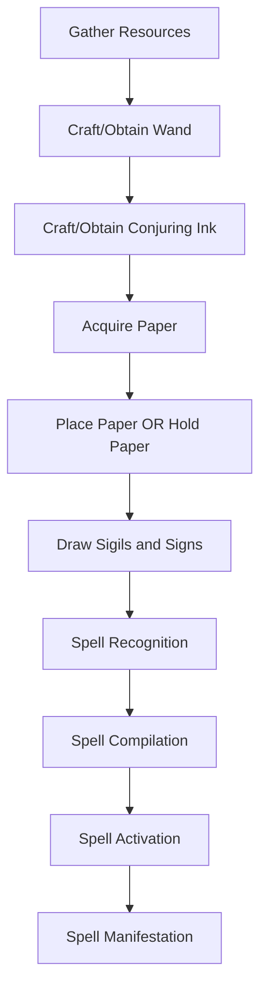

---

# Core Concepts

## Sigils

Sigils determine the ELEMENT or NATURE of the magic.

Examples:

| Sigil | Meaning |
|---|---|
| Fire | Heat / Flame |
| Water | Liquid / Flow |
| Earth | Matter / Stone |
| Air | Wind / Motion |
| Light | Illumination / Energy |

---

## Signs

Signs determine HOW the magic manifests.

Examples:

| Sign | Behavior |
|---|---|
| Column | Vertical manifestation |
| Bolt | Projectile |
| Dispersion | Area spread |
| Collect | Increment the spell |
| Levitation | Lift/Displacement of the spell |
| Convergence | Compress toward point |

---

# Spell Formula Structure

The spell structure is:

```text
Sigil + Sign = Spell
```

Example:

```text
Fire + Bolt = Fire Projectile
Air + Dispersion = Wind Burst
Earth + Column = Stone Pillar
Water + Collect = Water Gathering
Light + Levitation = Floating Light
```

---

# Player Interaction Flow

## 1. Gathering Resources

### Required Materials

| Resource | Purpose |
|---|---|
| Conjuring Ink | Magical fuel |
| Wand/Pen | Drawing tool |
| Paper | Spell medium |

---

## 2. Paper Types

The paper defines:

- drawing area
- spell size
- casting origin behavior
- possible future restrictions

### MVP Paper Types

| Paper Type | Description |
|---|---|
| Round Paper | Circular spell medium |
| Square Paper | Stable structured medium |

---

# Paper States

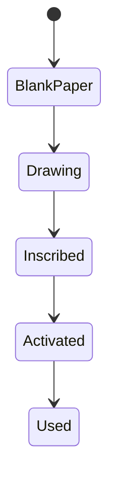

---

# Casting Modes

## Hand Casting

If the player is HOLDING the paper:

- spell originates from player hands
- Initial direction follows player look direction at cast moment
- After activation, spell remains locked to crosshair tracking
- direction follows player look direction
- Movement of the camera directly updates spell direction

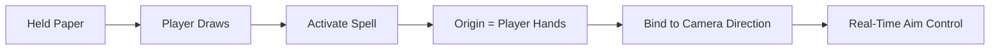

---

## Ground Casting

If paper is PLACED on a block:

- spell originates from paper surface
- spell orientation depends on paper face
- can later be modified by orientation sigils


---

# Spell Recognition Architecture

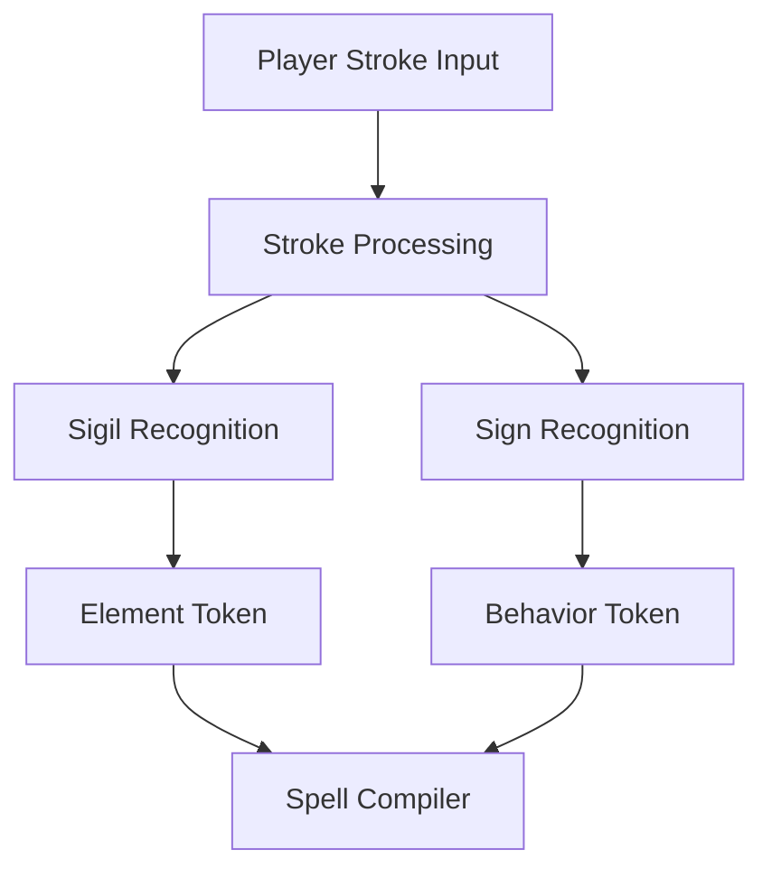

---

# Recommended Internal Tokens

## Element Tokens

```text
FIRE
WATER
EARTH
AIR
LIGHT
```

---

## Sign Tokens

```text
COLUMN
BOLT
DISPERSION
COLLECT
LEVITATION
CONVERGENCE
```

# Symbol System

The spell system is NOT binary.

A recognized symbol contains:

1. Symbol Identity
2. Geometric Properties
3. Drawing Quality

This allows spells to scale naturally based on how the player draws them.

---

# Symbol Structure

```java
class Sign {

    SignType type;

    float direction;

    float size;

    float quality;

    float symmetry;

    float confidence;
}
```

---

# Sign Identity

Identity determines WHAT the symbol means.

Examples:

| Symbol | Meaning |
|---|---|
| Bolt Sign | Projectile Behavior |
| Column Sign | Vertical Manifestation |

---

# Geometric Properties

Geometry determines HOW the spell manifests.

---

# Direction

The orientation of the sign controls spell direction.

---

## Example

### Bolt Sign

```text
Arrow Right → Projectile moves right
Arrow Up → Projectile moves upward
Diagonal Arrow → Diagonal trajectory
```

---

# Direction Flow

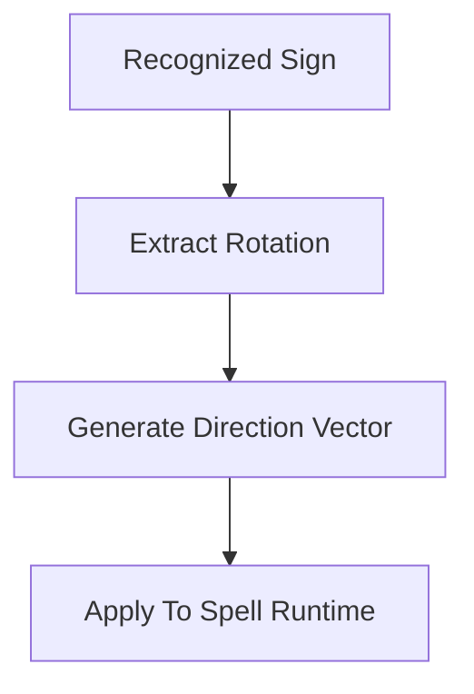

---

# Size

The size of the sign determines spell magnitude.

---

# Example Behaviors

| Sign Size | Result |
|---|---|
| Small Bolt | Small projectile |
| Large Bolt | Large projectile |
| Small Column | Thin pillar |
| Large Column | Wide pillar |

---

# Recommended Scaling Rules

Size should influence:

- range
- area
- force
- duration
- mana cost
- instability

---

# Example Scaling

```text
Bolt Size ↑
    → Projectile Speed ↑
    → Damage ↑
```

---

# Spell Magnitude Formula

Example conceptual formula:

```text
FinalMagnitude =
BasePower
× SizeMultiplier
× QualityMultiplier
```

---

# Drawing Quality System

The quality of the drawn symbols affects spell efficiency and stability.

This creates skill-based spellcasting.

---

# Quality Metrics

## 1. Shape Accuracy

How closely the symbol matches its intended template.

---

## 2. Symmetry

Measures balance of the drawing.

Useful for:

- circles
- convergence signs
- containment shapes

---

## 3. Stroke Smoothness

Measures shakiness and consistency.

---

## 4. Proportional Consistency

Measures whether important proportions are preserved.

---

# Quality Flow

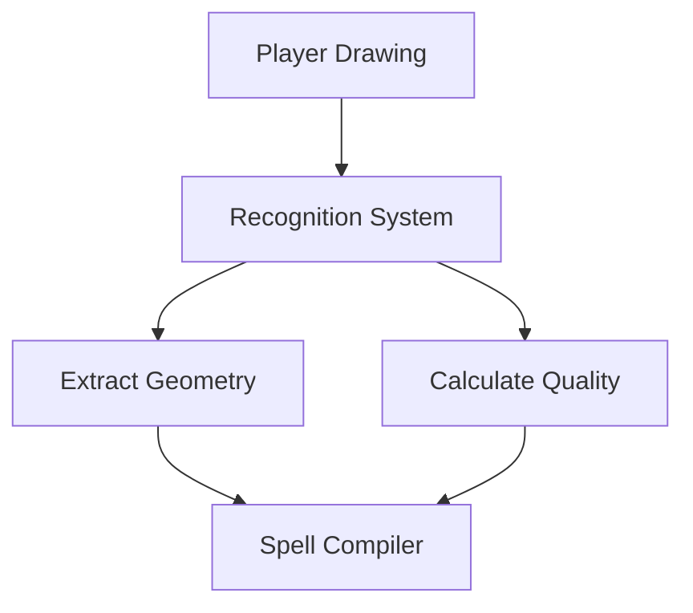

---

# Recommended Quality Output

```java
class SymbolQuality {

    float accuracy;

    float smoothness;

    float symmetry;

    float overall;
}
```

---

# Spell Quality Effects

Quality should NOT decide whether a spell exists.

Instead, it modifies spell performance.

This is VERY important.

---

# Low Quality Spell

Spell still works, but:

- shorter duration
- unstable behavior
- reduced power
- increased ink consumption
- chance of failure

---

# High Quality Spell

Spell becomes:

- efficient
- stable
- longer lasting
- stronger
- visually cleaner

---

# Example

## Low Quality Fire Column

```text
- flickers
- shorter duration
- smaller radius
- uneven particles
```

---

## High Quality Fire Column

```text
- stable flame
- longer duration
- larger radius
- smoother visuals
```

---

# Recommended Formula

```text
FinalDuration =
BaseDuration
× QualityMultiplier
```

---

# Suggested Quality Ranges

| Quality | Gameplay Result |
|---|---|
| 0.0 - 0.3 | Failed/unstable |
| 0.3 - 0.5 | Weak |
| 0.5 - 0.8 | Normal |
| 0.8 - 1.0 | Excellent |

---

# IMPORTANT DESIGN RULE

## Recognition and Quality are DIFFERENT systems.

Recognition answers:

```text
"What symbol is this?"
```

Quality answers:

```text
"How well was it drawn?"
```

---

# Recommended Recognition Pipeline

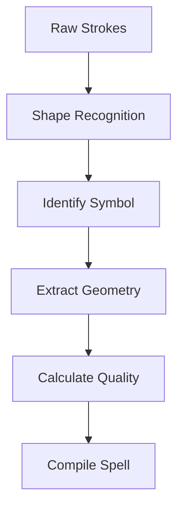
---

# Spell Compiler

The compiler combines:

- element sigil
- manifestation sign
- origin information

into a runtime spell.

---

# Compilation Flow

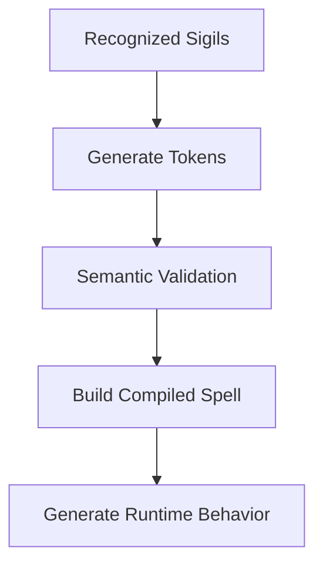

---

# Example Compilation

## Input

```text
FIRE + BOLT
```

## Output

```text
FireBoltSpell
```

# Spell Runtime Flow

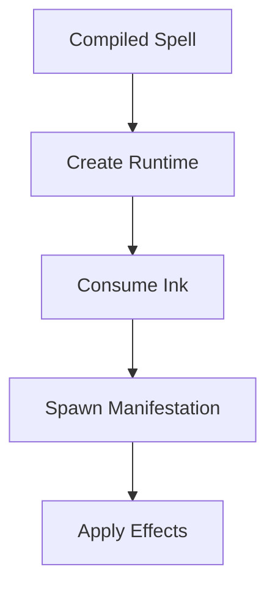

---

# Casting Origin System

The origin system determines:

- spawn position
- direction
- orientation

---

# Origin Types

| Origin | Behavior |
|---|---|
| HAND | Comes from player |
| PAPER_SURFACE | Comes from placed paper |

---

# Orientation Rules

## Held Paper

```text
Direction = Player Look Direction
```

## Placed Paper

```text
Direction = Surface Normal
```

Example:

| Placement | Direction |
|---|---|
| Floor | Upward |
| Wall | Forward |
| Ceiling | Downward |

---

# Manifestation System

Manifestation = physical behavior of spell.

---

# Example Manifestations

## Fire + Bolt

```text
Projectile Entity
```

## Fire + Column

```text
Vertical Flame Pillar
```

## Water + Dispersion

```text
Water Splash Area
```

## Air + Collect

```text
Pull Entities Inward
```

---

# Effect System

Effects should be modular.

---

# Recommended Structure

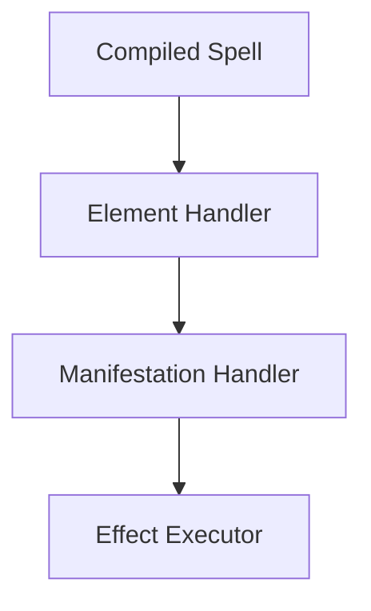

---

# Example Runtime Composition

```text
Element = FIRE
Sign = BOLT
```

Results in:

```text
ProjectileBehavior
+ FireDamage
+ FireParticles
+ IgniteEffect
```

---

# MVP Systems Breakdown
---

# 1. Drawing System

## Responsibilities

The drawing system is responsible for capturing and managing player input.

- stroke collection
- drawing surfaces
- coordinate normalization
- input smoothing
---

## Required Features

### Stroke Management

- begin stroke
- append points
- end stroke
- multi-stroke support

---

### Canvas Management

- clear canvas
- undo last stroke
- drawing boundaries
- paper-specific canvas shapes

---

### Surface Awareness

Support drawing on:

| Surface | Behavior |
|---|---|
| Held Paper | Screen-space drawing |
| Placed Paper | World-attached drawing |

---

### Coordinate Normalization

Convert raw input into normalized space.

Example:

```text
Mouse Position
    ↓
Paper Local Coordinates
    ↓
Normalized Stroke Data
```

---

### Stroke Smoothing

Reduce shaky input while preserving intentional geometry.

---

## Output

```java
List<StrokeData>
```

---

# 2. Recognition System

## Responsibilities

The recognition system identifies symbols from stroke data.

It determines:

```text
"What was drawn?"
```
---

# Recognition Categories

## Sigils

Elemental identity.

| Sigil | Meaning |
|---|---|
| Fire | Heat |
| Water | Flow |
| Earth | Matter |
| Air | Motion |
| Light | Energy |

---

## Signs

Manifestation behavior.

| Sign | Behavior |
|---|---|
| Bolt | Projectile |
| Column | Vertical |
| Dispersion | Spread |
| Collect | Pull |
| Levitation | Lift |
| Convergence | Compress |

---

# Required Features

### Template Recognition

- point cloud matching
- rotational matching
- mirrored matching
- scale normalization

---

### Symbol Classification

Output abstract tokens.

Example:

```java
ElementType.FIRE
SignType.BOLT
```

---

### Multi-Symbol Detection

Support:

- sigils
- signs
- containment symbols
- future modifiers

within the same drawing.


---

# 3. Geometry Analysis System

## Responsibilities

This system extracts physical properties from recognized symbols.

It determines:

- direction
- scale
- orientation
- proportions

This creates analog spell behavior.

---

# Required Features

## Direction Extraction

Determine intended directional flow.

---

## Size Measurement

Measure symbol scale relative to:

- paper size
- drawing area
- containment boundaries

---

## Orientation Detection

Detect:

- rotation
- alignment
- symmetry axes

---

## Relative Positioning

Support future systems like:

- nested sigils
- linked symbols
- ritual geometry

---

# Example

```text
Large Bolt Sign
    → Larger projectile

Upward Bolt Sign
    → Projectile travels upward
```

---

## Output

```java
SignGeometry {
    float direction;
    float size;
    float rotation;
}
```

---

# 4. Quality Evaluation System

## Responsibilities

The quality system measures HOW WELL symbols were drawn.

This system creates skill-based magic.

---

# Important Rule

Quality modifies spell performance.

It does NOT determine whether recognition succeeds.

---

# Required Features

## Accuracy Analysis

Compare symbol against ideal template.

---

## Smoothness Analysis

Measure:

- shakiness
- stroke consistency
- angular noise

---

## Symmetry Analysis

Useful for:

- circles
- convergence signs
- containment geometry

---

## Closure Analysis

Detect incomplete closed shapes.

Example:

| Shape | Result |
|---|---|
| Broken Circle | Weak containment |
| Complete Circle | Stable containment |

---

## Proportional Analysis

Measure preservation of important shape ratios.

---

# Quality Effects

Quality influences:

| Property | Effect |
|---|---|
| Duration | Higher quality lasts longer |
| Stability | Less distortion |
| Efficiency | Lower ink usage |
| Strength | Better output |
| Failure Chance | Reduced instability |

---

# Example

```text
Poor Fire Bolt
    → weaker projectile
    → unstable trail
    → shorter lifespan

Excellent Fire Bolt
    → stable trajectory
    → longer duration
    → stronger impact
```

---

## Output

```java
SymbolQuality {
    float accuracy;
    float smoothness;
    float symmetry;
    float closure;
    float overall;
}
```

---

# 5. Spell Compiler System

## Responsibilities

The compiler transforms recognized symbols into executable magical instructions.

---

# Compiler Inputs

```text
Sigils
+ Signs
+ Geometry
+ Quality
+ Casting Context
```

---

# Required Features

## Token Processing

Convert symbols into internal spell structures.

---

## Semantic Validation

Prevent invalid combinations.

Example:

```text
Light + Collect
```

might behave differently from:

```text
Earth + Collect
```

---

## Runtime Construction

Generate executable spell definitions.

---

## Magnitude Calculation

Calculate:

- power
- duration
- range
- mana/ink usage

based on:

- sign size
- quality
- paper type

---

# Example Compilation

```text
Fire Sigil
+ Large Bolt Sign
+ High Quality
```

Compiles into:

```text
Large Stable Fire Projectile
```

---

## Output

```java
CompiledSpell
```

---

# 6. Casting System

## Responsibilities

The casting system activates compiled spells in the world.

It determines:

- origin
- orientation
- activation conditions
- resource consumption

---

# Casting Modes

## Hand Casting

Spell originates from player hands.

---

## Ground Casting

Spell originates from placed paper surface.

---

# Required Features

## Origin Resolution

Determine exact spawn location.

---

## Direction Resolution

Use:

- player look direction
- sign direction
- surface orientation

to generate final trajectory.

---

## Resource Consumption

Consume:

- ink
- paper durability
- wand durability

---

## Activation Validation

Verify:

- valid spell
- sufficient resources
- stable compilation

---

# Casting Flow

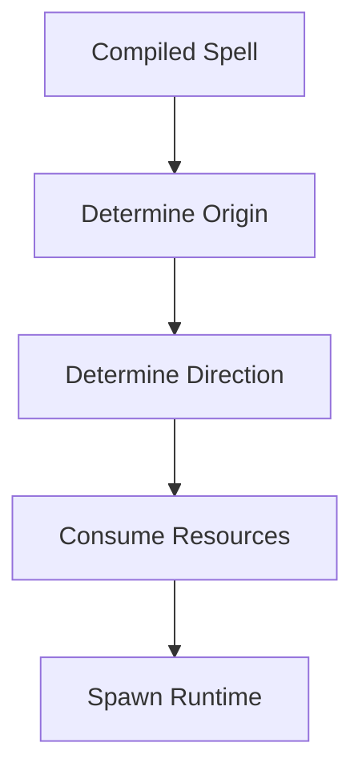

---

## Output

```java
SpellRuntime
```

---

# 7. Runtime System

## Responsibilities

The runtime system manages active spells after casting.

This system is responsible for:

- ticking spell logic
- movement
- persistence
- collisions
- duration

---

# Required Features

## Projectile Runtime

Support moving spells.

---

## Persistent Runtime

Support:

- columns
- fields
- levitation zones
- convergence areas

---

## Lifetime Management

Duration affected by:

- quality
- sign size
- future modifiers

---

## Collision Handling

Detect:

- blocks
- entities
- environment interaction

---

# Runtime Flow

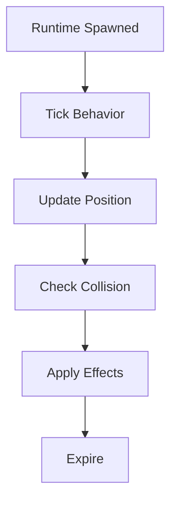

---

# 8. Manifestation System

## Responsibilities

The manifestation system determines the physical shape of magic.

This is the visual/behavioral layer.

---

# Required Features

## Projectile Manifestations

Example:

- bolts
- moving fire
- air slashes

---

## Area Manifestations

Example:

- dispersion fields
- columns
- convergence zones

---

## Spatial Transformations

Example:

- pull inward
- lift upward
- expand outward

---

# Example Manifestations

| Element | Sign | Result |
|---|---|
| Fire | Bolt | Fire Projectile |
| Earth | Column | Stone Pillar |
| Water | Dispersion | Water Burst |
| Air | Collect | Vacuum Pull |
| Light | Levitation | Floating Light Field |

---

# 9. Effect System

## Responsibilities

The effect system applies gameplay consequences.

This system should remain modular.

---

# Required Features

## Damage Effects

- fire damage
- impact damage
- knockback

---

## Environmental Effects

- ignite blocks
- push entities
- lift entities
- extinguish fire

---

## Visual Effects

- particles
- sound
- light
- distortion

---

# Important Rule

Effects should NOT depend on gesture recognition.

They only consume:

```java
CompiledSpell
```

and:

```java
SpellRuntime
```

---

# 10. Resource System

## Responsibilities

Manage magical materials and spell costs.

---

# Required Features

## Ink Management

Ink acts as magical fuel.

---

## Wand/Pen Durability

Drawing consumes durability.

---

## Paper State Tracking

Track:

- blank
- inscribed
- activated
- consumed

---

## Spell Cost Scaling

Costs increase with:

- sign size
- spell duration
- manifestation complexity
- future modifiers

---

# Resource Flow

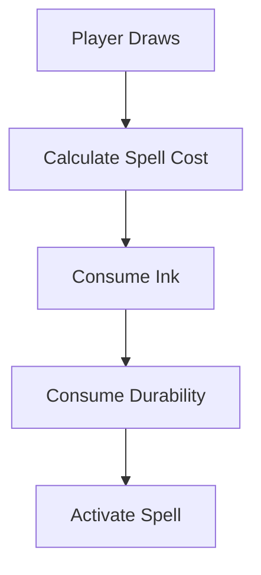

---

# 11. Networking System

## Responsibilities

Synchronize spell execution safely.

---

# Required Features

## Client Responsibilities

- drawing input
- visual feedback
- local prediction

---

## Server Responsibilities

- spell validation
- runtime authority
- collision validation
- effect application

---

# Important Rule

The server should ALWAYS be authoritative over:

- spell spawning
- damage
- world changes
- entity movement

---

# Final MVP Goal

The MVP should successfully demonstrate:

- immersive magical drawing
- responsive spellcasting
- geometry-based spell control
- quality-based spell scaling
- physical spell origins
- modular spell architecture